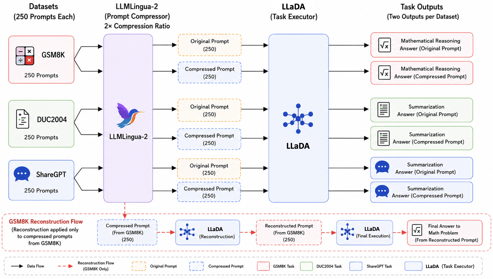

# Prompt Compression in Diffusion Large Language Models

<!-- Experiments on **prompt compression for diffusion LLMs (DLLMs)** using
[LLMLingua-2](https://github.com/microsoft/LLMLingua). Each prompt is compressed,
fed to the model, and (optionally) reconstructed back into a full prompt. We then
compare the original, compressed, and reconstructed responses to measure how much
quality survives compression. -->

This repository contains the code for the paper:

**Prompt Compression in Diffusion Large Language Models: Evaluating LLMLingua-2 on LLaDA**

<!-- Sterling Huang, Abigayle Brown, Jiyoo Noh, Jiakang Xu, Wantong Huo, Kaung Myat Kyaw, Jonathan H. Chan
Accepted at IAIT 2026 (14th International Conference on Advances in Information Technology). -->



## Overview

Prompt compression has become an effective approach for reducing inference cost and context length in large language models. Existing prompt compression methods, such as [LLMLingua-2](https://github.com/microsoft/LLMLingua), have primarily been evaluated on autoregressive language models. However, little is known about how these methods transfer to diffusion large language models (DLLMs).

This work investigates the effectiveness of [LLMLingua-2](https://github.com/microsoft/LLMLingua) when applied to LLaDA-8B-Instruct, a diffusion-based large language model. We evaluate whether compressed prompts preserve downstream behavior across multiple task categories, including:

- Mathematical reasoning ([GSM8K](https://huggingface.co/datasets/openai/gsm8k))
- Prompt reconstruction ([GSM8K](https://huggingface.co/datasets/openai/gsm8k))
- Formal summarization ([DUC2004](https://duc.nist.gov/duc2004/))
- Conversational summarization ([ShareGPT](https://huggingface.co/datasets/Lin-Chen/ShareGPT4V))

Our results show that high semantic preservation does not necessarily imply stable downstream reasoning performance in diffusion language models. While summarization remains relatively robust under prompt compression, mathematical reasoning degrades substantially despite strong semantic similarity scores.

## Repository layout

```
DLLM-Compression/
├── notebooks/                  # Response-generation pipelines (run on Kaggle/Colab GPU)
│   ├── llmlingua2_compression_pipeline.ipynb                 # original + compressed + reconstruction responses
│   ├── llmlingua2_compression_reconstruction_pipeline.ipynb  # above, plus re-answering the reconstructed prompt
│   └── llmlingua2_reconstruction_only.ipynb                  # reconstruction-focused variant
├── evaluation/                 # Offline scoring of generated responses
│   ├── gsm_evaluation.py        # BLEU/ROUGE/BERTScore, exact-match, stats, distribution plots
│   └── check_exact_match.py     # compares reconstructed vs. original GSM answers
└── data/
    ├── meta_results.json        # aggregated metrics across all datasets
    └── responses/               # raw model outputs (250 samples per dataset)
        ├── gsm_responses.json
        ├── gsm_responses_reconstructed.json
        ├── duc2004_responses.json
        └── sharegpt_responses.json
```

## Installation

Clone the repository:

```bash
git clone https://github.com/axxx129-ops/DLLM-Compression
cd DLLM-Compression
```

Create an environment and install the dependencies:

```bash
python -m venv .venv
source .venv/bin/activate        # on Windows: .venv\Scripts\activate

# Notebook (response-generation) dependencies
pip install torch transformers tqdm numpy

# Evaluation extras
pip install matplotlib scipy bert-score
```

The response-generation notebooks expect a GPU environment (Kaggle/Colab). The
evaluation scripts in `evaluation/` run on CPU.

## Pipeline

1. **Generate** — run a notebook in `notebooks/`. It loads a compression dataset
   (GSM8K, ShareGPT, or DUC-2004), generates responses for the original,
   compressed, and reconstructed prompts, and writes a `*_responses.json` file.
2. **Evaluate** — use the scripts in `evaluation/` to score those response files,
   producing reconstruction-quality metrics (BLEU, ROUGE, BERTScore), GSM math
   exact-match accuracy, and BERTScore distribution plots.
3. **Summarize** — aggregated results across datasets are collected in
   `data/meta_results.json`.

## Datasets

We used a subset (250 samples) of each of the following dataset.

| Dataset  | Task                    | File                                              |
| -------- | ----------------------- | ------------------------------------------------- |
| GSM8K    | Math QA                 | `data/responses/gsm_responses.json`               |
| GSM8K    | Math QA (reconstructed) | `data/responses/gsm_responses_reconstructed.json` |
| ShareGPT | Conversation            | `data/responses/sharegpt_responses.json`          |
| DUC-2004 | Summarization           | `data/responses/duc2004_responses.json`           |

## Requirements

The notebooks expect a GPU environment (Kaggle/Colab) with `torch`,
`transformers`, and `tqdm`. The evaluation scripts use `numpy`, and optionally
`matplotlib`/`scipy` for plots and `bert-score` for BERTScore.

## Citation

If you use this work, please cite:

```bibtex
@misc{huang2026promptcompressiondiffusionlarge,
      title={Prompt Compression in Diffusion Large Language Models: Evaluating LLMLingua-2 on LLaDA},
      author={Sterling Huang and Abigayle Brown and Jiyoo Noh and Jiakang Xu and Wantong Huo and Kaung Myat Kyaw and Jonathan Chan},
      year={2026},
      eprint={2605.17932},
      archivePrefix={arXiv},
      primaryClass={cs.CL},
      url={https://arxiv.org/abs/2605.17932},
}
```

## Acknowledgments

This work was supported by the Mitacs Globalink Research Award and the Innovative
Cognitive Computing Research Center.
